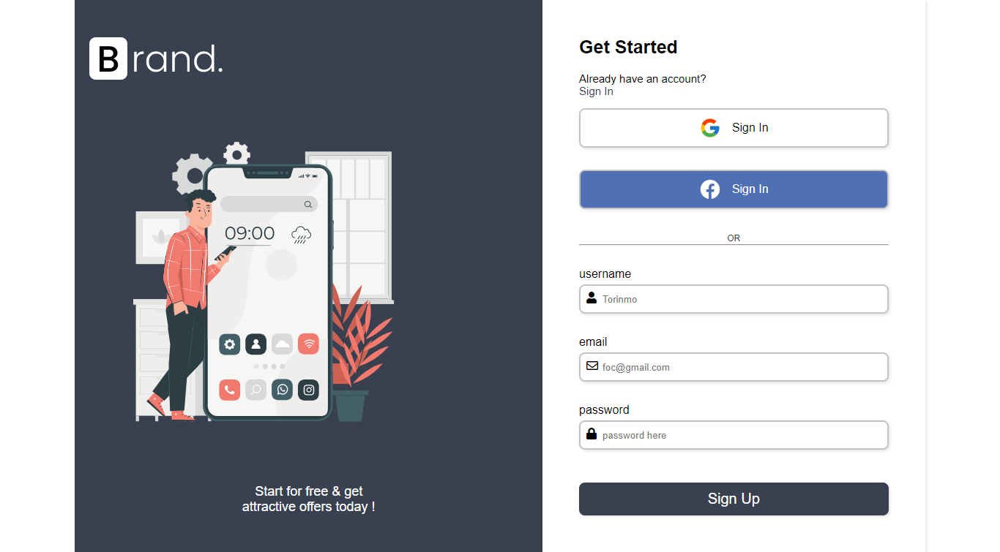

## Overview

### The challenge

Users should be able to:

- View the optimal layout for the site depending on their device's screen size
- Validate the sign up form
### Screenshot

### Links

- Solution URL: [Add solution URL here](https://your-solution-url.com)
- Live Site URL: [Add live site URL here](https://your-live-site-url.com)

## My process

### Built with

- Semantic HTML5 markup
- CSS custom properties
- Flexbox
- CSS Grid
- Mobile-first workflow
- Javascript
- Media query

### What I learned

How to validate a form using Javascript
And View the optimal layout for the site depending on their device's screen size
### Useful resources

- [Example resource 1](https://www.freecodecamp.org.com)

